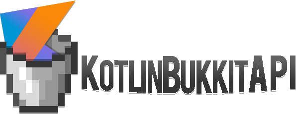

## KotlinBukkitAPI

[![GitHub stars](https://img.shields.io/github/stars/DevSrSouza/KotlinBukkitAPI.svg?style=for-the-badge&color=orange&logo=data:image/png;base64,iVBORw0KGgoAAAANSUhEUgAAAEAAAABACAYAAACqaXHeAAADYklEQVR4XuWbvbPNQBiHn9uo6NFT0GEYHa0/QofOR2MojI8xxmh8VFwVf4RaxTB0KOhdPRUF8zPJmdy1J3l3N9ndxDb3zr0n2exzfu/zJjk5G5Qdh5vp35c6jI1SEzfzbgK/gXOljqMkgF3A1wbAXuBHCQglAehdf9wsWr8rDdlHSQCq+0MdBxzJvnqgFADJ752zYAHILsNSABT3Mw4A/S27DEsAaOW30wHwHcguwxIAuvJzyz67DEsA6MrPBaD/ZZVhbgA++bkQssowNwCf/FwAWWWYE8A6+bkAssowJ4A++RWTYU4AffIrJsNcACzyKyLDXAAs8isiwxwArPIrIsMcAELkl12GOQCEyC+7DAUgpj5LXLpPMeemAOwAXgLHp5ih4n2+Ak62JbCnuRmhn//D2ALUmre6DlAClAQlYsnjJ3ACeK1FuhI8CzxZ8uqbu06rG7C+LrBkKf5zpekDsFQp/pUeoBJYjXXnAUuT4kp6bnn3nQgtRYrbpBcCQK9dghR7b7RaToXnLMXB22sWAHOVold6oSXQvn5uUlwrvVgA2m4uUuyVXgqAuUgx6NMliwN8t6rcDzZrOXselF5qArR9rVI0SW8MANpHbVI0S28sADVJMUh6YwKoRYpB0hsbwEHgQ2ED6hg+xR5DTBfoznUDuB47+Ujb6Rhuxu4rFcBH4EDs5CNtp3dfKYgaKQBqiH+76OgySAFQQ/xbANFlkAKghvi3AKLLIBZATfFPKoNYADXFP6kMYgHUFP+kMogBUGP8o8sgBsBY8f8MXGqO/D6wP6qRb98ouBvEAEiNvx6DuwU8BH41x69L7AvANUBPlMSO4G4QCiAl/vpqzDPgKvBtzQp3A3eB0wmP8gedFIUCiI3/G+A88Nb41h4DHgFHja93r0/M1wahAELjr3f6CvC8+W5QyHp0bEqCEqFkWEdQGYQACIm/blI8AG4DqvmUISfIDXKE9dkFcxmEALDG/wVwEfiSsmrPtvsaqKcM+zV3gxAAQ/Fv25oATDkEYKhtmsvACqAv/r62NiUA7dvSNk1lYAXgi7+lrU0Noq9tmsrACsCNf2hbmxqEr22aysACoBv/lLY2NQRf2xwsAwsARUlnb2O1talBdNvmnaEbphYA94CnE7S1qUGobeozzMt9E/0BUX274HXoySkAAAAASUVORK5CYII=)](https://github.com/DevSrSouza/KotlinBukkitAPI/stargazers)
[![GitHub issues](https://img.shields.io/github/issues-raw/DevSrSouza/KotlinBukkitAPI.svg?label=issues&style=for-the-badge&color=orange&logo=data:image/png;base64,iVBORw0KGgoAAAANSUhEUgAAAIAAAACACAYAAADDPmHLAAAOd0lEQVR4Xu2dB7BtNRWGP+wioCj2XrCAvY1iw95FsStWVKxg7w27KApiQWxYQEUUu9jLiA2sKAoW1LEjKnYQy3xjzpvDffecnewku5y718ydN/POTrLKv7OTtVZWtmCiDa2BLTa09JPwTADY4CCYADABYINrYIOLP80AEwA2uAY2uPjTDDABYCU1cHbgSsCOwGWBSwEXB7YDzgdsA/jM2YL0pwGnAn8GTgZOAn4B/BT4MfA94DjA51aKVmUGuChwM2Cn8LcDcJbCljo9gOBLwFHAZ4BfFR6j8+7GDIDrAHcFbgdcpXPN/X/A7wAfBd4LHNMTD1nDjg0ATuW7A/cBLpMlefnGfioOBd4cPh3lR6jQ4xgAII+3BfYEbgWD917+B/gksD9wJPDfCnYr1uWQAXBm4H7Ak8OCrpjQHXbk4nEf4BDg3x2OGz3UEAEgT/cGngtsHy3JsB88HngOcNjQZoShAeD6Yep0gbeK9GVgL+DooQg3FACcB9gXePBQFFORD9cEbwiftlMqjhPV9RAAsAtwIHChKI5X5yF9CHsAH+5TpD4BcK4w3but28gk+B8P/KMPJfQFAN20RwBX6EPoAY7pbmFX4ISueesDAHrvDga26lrYgY9nHOL+wAe65LNrADwVeNEInDld2mB+LJ1I+j1cEHdCXQHgTMBrw6KnE8FGPsirg+ezuhexCwAYlXtbcO6M3C6dsq/O3BZX9SDWBoDGf3dY4HSqvTDYb4CvA8eGBdaJgP/3e+Cvc/F98wJck5gvcOGQP3B54KrAtYAL9sE8cHfg8Jpj1wSA0/47On7zNaoBGP8+C/ykkPJMKjHfwKDUrYEtC/W7rJu9gzu86lA1AeD+VkdHbXLh9DHgLSE2X3s/rfHvADwoRCcFemnqxPgyXQsArvZfXFora/pz23QQcADw88pjLere/ATD1A8Bti7EQ2fGrwUA9/nvqQiuvwH7AS8H/lRI6bndnBd4UgBDzuch1/hGUKXZv41ylZ4B9PB9raKT5+2As8tQc/EuFuL/hrNTqYTxDTlL0X2VBIC+fVfcNdy7LuYeGhIxUxXbx/MuFF8PXDJy8GiDLejPN35m/NkjUX2WBIAhTr+FpcnFnd9ZV/hjIlPPXwPs1sB0lKGW9LGe8aNBUAoAhnTfX9g6rubdRTjt51CuNy1XR85cLlQ9h7CWaho/CgS5wjnItiFfvmQ8X2eNWy0/KbnUNwDk30wngzznnxOmC+M3gqAEAN5UOJPHkOgtC27thgAADaEzyWzhS6cs0hK++U0vyrqAywWAyPakTCkyLn5z4LelOiyQhJmro3lRPMF0F8BgT1ta9s1v6nMzEOQIZ9uvAqUSOH3zb1zY+CpkKDNAk3Fifs8x/rqfgxwAeDrHfPcS9GvgegWn/XmeVgUAJYy/GQjaAsBDG98vlLfvav9GhRZ864FxFQBQ0vhnAEFbADwwBF9KvP0PCPkCJfoaGgCMFQjAn2UIV8P4m0DQBgC2cbGm2zeXdPLUPgvQ1wyg8T8XEjpuEuoNpOqrpvHlZe82APA49kdSJVnned27V+vAw9cHAGbGn7mCfwgIAtc6sVTd+AaN2gDAZAt93bnkds8iC7WpawCsNf5Mvh8EEPwuQuBOjC8fqQBQON/c1HZrZda9awp0F9QlABYZfyann86dQ0raItk7M34bADwfeGam1Yznm2/XVUi3KwA0GX+mtm+H9LI/rKPHTo3fBgC+/boyc+iFBUCUMn4XAIg1/ozvbwSP53xCS+fGTwWAHj+TPXLINC6V9cecThLb1gZAqvFn7KtLYx7qpBfjpwLgJcBTEpW/9nHTuEyd6pJqAqCt8WfyG0f5PPC0igpZGnVMWcxZESunGpcHHCzs1HUCZy0A5Bq/os03dd0Yco4FgFEsCyfmkL4DY/xdUw0ArITxUz4BFmvyqFIO3S3U08vpo03b0gBYGeOnAOB1wMPbaD+0MZ/vAj0VQSgNAL/Zhq2HSo3T/jzjsZ8A966ek2tLnm/znFsfVBoArmO+APhZHBolGT92BjCZ0Tc4p/au2cKmjvVBpQGgDDqyDPR4kHQolGz8WABcHfhmppTmw5U6qJnKSg0AyIPRUEHgp61vamX8WADcN5zybSukGb59vim1AKA+3BZ7CtkS9H1Ra+PHAuDZIYu1rYB9bf9m/NYEgGNcA/h0SI9vq6O27bKMHwsAq197FLot6UGs6elq4qs2ABz/2sCngHM3MVPw92zjxwLAXPZbZDBuxo+ZP31RFwBQNlPkP17wmPgyfRUxfiwAXAC6EGxLNw2Lpbbtc9t1BQD5NLnVYhUelK1FxYwfCwB9996305ZcLZsN0xd1CQBltJSM5V/PWUHgosaPBYAx65xvm+fhLMrUF3UNAOX0YosPLjgQ2lYPxY0fCwDz9s/RluvwJvwzo31u0z4AIM+3B943dzNZjhxVjB8LAMO4OYWQPERiIae+qC8AKO+dQ7mcHC9qNeNPAIiDZGy8ZFFvxkDeCfgipFKu8c3ffMGyQWOEmz4BqWbb/HnPUZoJnTKT5hrfNDOzr5buSGIAMC0C8wFgDx6B0x8So/MSxrdmkLmXVjBbSDHMTNvAMgCwF8vFWDxqmd5LGd/xvPp2aRZ3DAByHUHuiw2Y9EV9LgLXk/lRSwpElDS+Y1tiRzd11gzwiZC+3NaAG8UVnKKfxwKvXNOgtPHtXtf0bXIBMAWDUkwb/6wXQ7w0PF7D+HZt6b6H5QLgWcDz4uXa7EkvV9Yp0hcN7RMwrwd16/YwurTrOkpcdqjkGeGGlqxPQG5CiAWfSpaQ6wtIQxy36USRJWvflTsDlEgJuxzg7doTldNAk/EdyYyl7+YCwNs0PNGb4850+/PGcrJv+J5ijH9acAKdngsA238rVPNoq3mDIpaRnyhfAzHGdxS379dsGi7GD2Af3vj1iKbOlvzuDGL27N8z+piapp0ithjlY5qUFguA3IWgfNwjRMaaeJp+X18DsW/+rPW9woVdS/UZC4CLAL/MtIypUhaYmihdA6nGd+vrzquxHlEsAGQ593iYOQEeq8qpmZeuuvG3SDW+Eje6gGdqSQGAl0B5XUsOvQJ4Qk4HLdoO2RHUJE4b49unOQA6mRopBQBeoHhMY4/LH/hLKBGzXoGkzK4XNh8rANoaX0Xou3HGbqQUANjZj0Ld+8aOlzzgTPL0nA4S244RADnGPx64YqyOUgFgTCBqalnCgFtBL5bKrTgSK+PYAJBjfHXiUT7L+UVRKgAsfeop35TUpvUYORRwa9kFjQkAucY3gdcKJtEvVyoANJjbuaUx5kirmjvvsbPaNBYA5BpfPSYfxG0DAC9QNsSbS6YrWSzaOnk1aQwAKGF8dZj8UrUBgAMZYdqxgNW6qBk8dACUMr6r/uQznG0BUKJq2Aw/uwNmHdWioQJA3btgy0kGmdeZqeeeP0iitgAwi8XK1yWuifXYmLX0c8vQLhJ8qADwwMhhSdZa/LAzsp/T5BNYbQEgK/dsyjZJEE6ftZdGnZjQJvbRIQLARA3LxG4VK0TDc7sCR7TpKwcAtlUIDVeCdDJZfy/lVo2YcYcGALdpXyxYZs6Sdc6grSgHAA54XeArkaddYhj0JjJvEikJgiEB4BLhjIRBsRLklG/ef+sqbrkAUAhPuixNPU6U1JnAMupuE0vQUABgbUHPWMReKR8ju7eTPzrmwUXPlACAxSOOA8wZKEVmEt+p0MJwCAC4YbhdvWQ5Ob19OwAG2FpTCQA4uFXAP9Sai/Ubujt4ZIECU30DwIRY07NMri1JJtfolc2iUgCQiQOBPbK4Wb+xVcqd5rKQXoGvpi63CbmUNWIeBwB7NjEQ83tJAGwJHB2mpZixU55xeyi4uogdpPC16Fmv1TsIcNFXmvT4ufMqUnanJAAU1IWOIBD9NcgootfWREe7ajCxpE8riHstjgmZNchaDa76ix2yKQ0Ahd4lOCVq9G3/5hP4Td0HOLmGllv0aREGq3HsVak8nCy55btjoUDcJhFrGemJwMtaKDKliSXsLUG/X8EtY8r4PusU77fYbfDWqY0Tnxdcr0ps0/h4LQA4sG+pxRBqk2+GdXotv+JOxEMoNcmSeZ52tuSLK/E2xZ9S+dsfsKZAcaoJALOG3grsVpzrxR36eXCh6PbIqiQnFBrbMiuWvDUXwgVe7bd9nu2Dww3rudvZdVVREwAO6Nvh8WQvjOqDDDJ5S+exAQzuJry/4KRwC8qpgSlvRdGo2waHllO7kU5zHrwws6/j7UYLDfOa6lWFagNgBgKnZ3MIJorXgG++V+1UM76sdAGA2Tg6L7pYE8SreLhP+s1/HFBl2p8XuysAzMb0VJC7g67HHa6pz8iZC1oNX3y1v0gBfRjCII+5gLWcRWMx9lo+LerogrlEwm20DvoAgMxtHyppXzma09V+UPeuWT2d36zWFwA0pxcq7JtZeGIVYOF0r3u7iG8/VSF9AmDGq6Fkk0pK5hOk6qGP541n6EHMDunmMD8EAMi/SSUWTVQhQ+EpR6/L2rrQ8y5mb1LrPcQ9NGUb6XILtFMt7ffcrwmcunRb5/CV5n9oAJjJZ8685VO9cGoVyLx9D4G0St2uqYChAkCZjSVY6dIFknn0YyRX916cqUs3+dBGFwIPGQDz8huAMRzqv7lH02vrVdftkeFTNvgMprEAYGY07y+0/LwBErOPhkRW5jgkhKWHmrG0mb7GBoB5ATwJa5TREK0XOHcti356I41u4w6PrckzJMTKS9dKqyW/4dqdAfPvbxDCuGctPJi1dz0Qe1Q42mW+QWMdvsI8FO9uVQCwVjEa33i+rmaPYZnQ4edjO8DDGfodzAHwTzIvwL9TQp6hN516V5Knk3TPuop3iv9XcQv03OGqAqBntY5n+AkA47FVFU4nAFRR63g6nQAwHltV4XQCQBW1jqfTCQDjsVUVTicAVFHreDqdADAeW1Xh9H/8KXmfpqCDOQAAAABJRU5ErkJggg==)](https://github.com/DevSrSouza/KotlinBukkitAPI/issues)
[![GitHub last commit](https://img.shields.io/github/last-commit/DevSrSouza/KotlinBukkitAPI/master.svg?style=for-the-badge&color=orange&logo=data:image/png;base64,iVBORw0KGgoAAAANSUhEUgAAADgAAABACAYAAABP97SyAAADZElEQVRoQ+2ZSciOURTHf1+ZZdoZMpdhIUOyJGTe2CpLyRhKYYGwQUghQ1nJ3sZQhpIQGbKhEMk8LMg8Rf/PfdT3ed/nTs/z9Xi7d/Uuzv+c8z//59577nmbaPDV1OD8SAT/d4WTgknBilcgfaIVF8iaXlLQWqKKGyQFKy6QNb2koLVEFTdICkYI1B2YA0wBxgKDgB7G3zvgIXATOAccB95HxKoLLUPBocA6YB7QxTHpT8BRYCvwwBHjZFYkwY7AZmAV0N4p+r9G34AdwCZAv6NXUQQHAseAMdEZ/XFwHZgLPIn1VwTBkWYf9Y5NphX+GTAZuBvjN5Zgf+AK0CcmiRysFJwAPA/1H0NQ++wSMD40uCPuMjAR+OFo38IshuAGcxiExPXF6FTWCeu9Qgn2A+4DnRwi6q47aPbpI2OvO1H34yJgtIOPj4Cun5cOtoUouBtYYQn2GVgOHM6xU4EXAvJnK9Z2YE1bENR99wLomRNM5GYAFxwTmgScspB8A/QFvjv6bDYL+URnm9YqL84Ci3K1sPpc91uSnw6c9iX4ywfgYKs9N87BrrWJii2sy550di+nRROUEjpUQtYSYF8IsB6mDILDgHuBSY4A7gRia8LKIKhDKLRRFvZLIuhRgTIUHB7RIKtxv+2Rv9W0DIKLgQPWyLUNlgF7ArFttgdvmRGF7+msYgs7qmiCvv5mAScsoJCrYimw1+J3GnDGJ+GQTkYnnd5nvXIC6SScCZx3TEYP25OAfNdbrwE1+aW3akpgl5m95OUvkiuBQznNhAqsy32nhZzibAPWOhbsr1mIggKr6dVzqbNDQO0rkdR4UKNCrSHAVPOScNlzei4J88ohXguTUIJyst5M0XxjhthLOSnovWIItgMumpmJd2APgGLoOfXTAxP9iWYOtOmvmk82JL4N89gUUO/PoBWjYBZQDbL2V9GTtadmbBjauDfnVwRB+RlgBr/6D6KIdc0MfkUyahVFUEl0ADYCq83vkMS+Apq9bPG97+oFK5JgFmOwGQ7NB7o6svwAHDEnZTZ5c4Tmm5VBMIvYDVBbl/19JuLZoOqtuRNvAGfNwEkkC19lEiw82RCHiWBI1aqESQpWSY2QXJKCIVWrEiYpWCU1QnJJCoZUrUqYpGCV1AjJJSkYUrUqYRpewd/nrH4569+7pgAAAABJRU5ErkJggg==)](https://github.com/DevSrSouza/KotlinBukkitAPI/commit)
[](https://choosealicense.com/licenses/mit)
[](http://jenkins.devsrsouza.com.br/job/KotlinBukkitAPI/)

KotlinBukkitAPI is an API for Bukkit/SpigotAPI using the cool and nifty features Kotlin has to make your life more easier.

* Need help? contact me on [Twitter](https://twitter.com/DevSrSouza)

### Contents:
  
  * [Documentation](https://github.com/DevSrSouza/KotlinBukkitAPI/wiki/)
  * [Issue reporting](https://github.com/DevSrSouza/KotlinBukkitAPI/issues)
  * [Dev builds (download)](http://jenkins.devsrsouza.com.br/job/KotlinBukkitAPI/)
  * [Starter project](https://github.com/KotlinMinecraft/KBAPI-StarterProject/)
  * [Setup for development](https://github.com/DevSrSouza/KotlinBukkitAPI/wiki/Getting-Started)

# Samples

KotlinBukkitAPI goes beyond this samples, and you can find all of it in the [wiki/documentation](https://github.com/DevSrSouza/KotlinBukkitAPI/wiki/).

Event DSL sample
```kotlin
plugin.events {
  event<PlayerJoinEvent> {
    player.msg("&3Welcome ${player.name}".translateColor()) 
  }
  
  event<PlayerQuitEvent> {
    broadcast("&eThe player &c${player.name} &eleft :(".translateColor())
  }
}
```

Simple Command DSL example
```kotlin
plugin.simpleCommand("twitter") {
  sender.msg("&eFollow me on Twitter :D &ahttps://twitter.com/DevSrSouza".translateColor())
}
```

Item meta DSL and other stuff
```kotlin
val gem = item(Material.DIAMOND).apply {
  amount = 5
  meta<ItemMeta> {
    displayName = "&bGem".translateColor()
  }
}
val encbook = item(Material.ENCHANTED_BOOK).meta<EnchantmentStorageMeta> {
  displayName = "&4&lThe powerful BOOK".translateColor()
  addStoredEnchant(Enchantment.DAMAGE_ALL, 10, true) // putting sharpness 10 to the book
}
```

Another approach:
```
val gem = item(Material.DIAMOND, amount = 5).displayName("&bGem".translateColor())

val encbook = metadataItem<EnchantmentStorageMeta>(Material.ENCHANTED_BOOK) {
  displayName = "&4&lThe powerful BOOK".translateColor()
    addStoredEnchant(Enchantment.DAMAGE_ALL, 10, true) // putting sharpness 10 to the book
}
```

Menu creator DSL
```kotlin
val myMenu = menu(+"&cWarps", 3, true) {

  val arenaPvP = item(Material.DIAMOND_SWORD) {
      addEnchant(Enchantment.DAMAGE_ALL, 5, true)
      displayName = "&4Arena PvP".translateColor()
  }

  slot(2, 4, arenaPvP) { // Line, Slot
    onClick {
      player.teleport(Location(player.world, 250, 70, -355))
      close() // close the menu
    }
  }

  slot(2, 6, item(Material.GOLD).displayName("&6Shop".translateColor())) {
    onClick {
      player.teleport(Location(player.world, 2399, 70, -1234))
      close() // close the menu
    }
  }

  // when the menu renders to a player, will show the Paper item with their name.
  slot(3, 9, item(Material.PAPER).displayName("Hello {player}")) {
    onRender {
      showingItem?.meta<ItemMeta> {
         displayName = displayName.replace("{player}", player.name)
      } 
    }
  }
}

// open to player
myMenu.openToPlayer(player)
```

You can find more examples in the [Documentation](https://github.com/DevSrSouza/KotlinBukkitAPI/wiki/)

# Project

## Dependencies
| Name | Version |
| --- | --- |
| [Spigot API](https://hub.spigotmc.org/stash/projects/SPIGOT/repos/spigot/) | 1.8.8+ |

## Dependencies Embed
| Name | Version |
| --- | --- |
| Kotlin STD + JDK8 | 1.3.71 |
| [Kotlinx-coroutines](https://github.com/Kotlin/kotlinx.coroutines/) | 1.3.5 |
| [Skedule](https://github.com/okkero/Skedule) | 1.2.6 |
| [Kotlinx.serialization](https://github.com/Kotlin/kotlinx.serialization) | 0.20.0  |
| [KAML](https://github.com/charleskorn/kaml) | 0.18.1 |

## Modules
| Module | Description |
| --- | --- |
| Core | The heart of the project containing the important API and extensions |
| Plugins | Extensions for others plugins like Vault, PlaceholderAPI and others |
| Exposed | Extensions for SQL framework [Exposed](https://github.com/JetBrains/Exposed/) |
| Serialization | Extensions for [Kotlinx.serialization](https://github.com/Kotlin/kotlinx.serialization) |

## Consider donate

<a href="https://www.buymeacoffee.com/DevSrSouza" target="_blank"></a>

<br />
<br />
<br />


